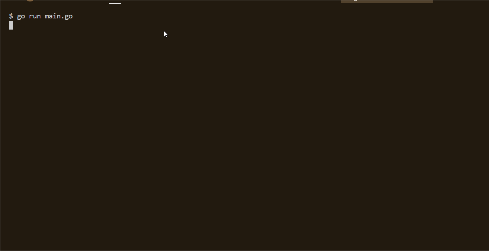

# GifToCmd
将gif在命令行展示出来。可以扩展为播放任意gif 喜欢的点个star(￣▽￣)"

## 演示
蔡徐坤打篮球


蔡徐坤+罗志祥


## 编译
```shell
git clone https://github.com/Coder-Qing/GifToCmd.git
cd cxk
go build -o /path/executablefile ./*.go
```

借鉴来自于[https://github.com/masterZSH/cxk.git](https://github.com/masterZSH/cxk.git)(我基本都是fork过来的＞︿＜
